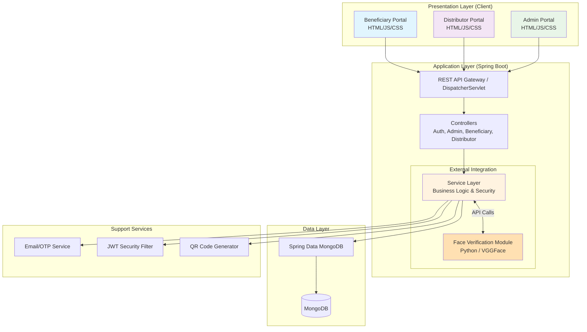
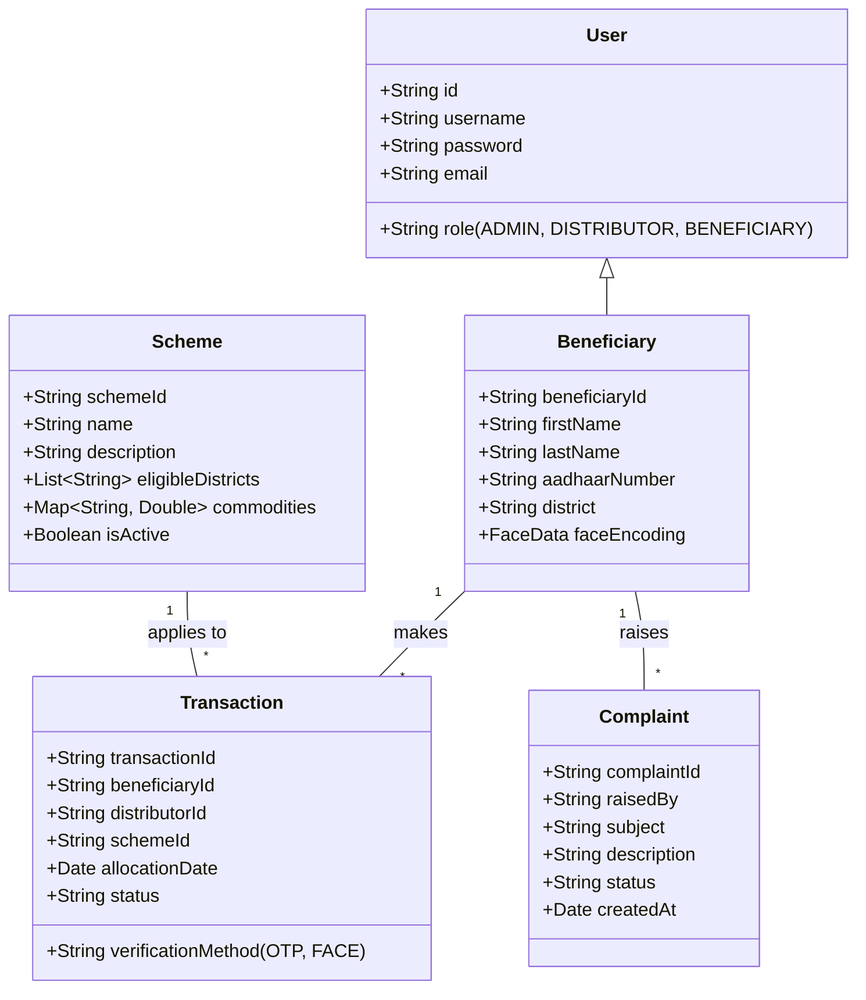

# 🌾 Smart Ration Distribution System — PDS Portal

<p align="center">
  🚀 A comprehensive Spring Boot web application that revolutionizes the Public Distribution System (PDS) by ensuring transparent, secure, and efficient ration allocation using OTP and Face Verification technologies.
</p>

<p align="center">
  
  
  
  
  
  
  
  
</p>

<br>

---

## 📖 Problem Statement
The conventional Public Distribution System (PDS) suffers from significant inefficiencies and corruption due to its reliance on fragmented, manual processes:

### Identity Fraud & Leakage
- **Impersonation**: Fake ration cards and impersonation lead to massive resource leakage, depriving genuine beneficiaries of their rights.
- **Manual Authentication**: Reliance on physical signatures or basic ID checks makes the system easily exploitable.

### Lack of Transparency
- **Information Asymmetry**: Beneficiaries are often unaware of the exact schemes, commodities, and quantities they are entitled to.
- **Hidden Inventory**: Distributors can manipulate stock records due to the lack of real-time digital tracking and oversight.

### Process Inefficiencies
- **Manual Record Keeping**: Paper-based allocation logs are tedious to maintain, prone to errors, and difficult to audit.
- **Communication Gaps**: Critical updates regarding stock availability, new schemes, or policy changes take weeks to trickle down to the grassroots level.

These inefficiencies result in delayed distribution, financial losses for the government, and most importantly, food insecurity for vulnerable populations.

<br>

---

## 💡 Our Solution
The Smart Ration Distribution System revolutionizes the PDS by providing an integrated, automated platform that eliminates fraud and manual inefficiencies. Our solution delivers:

### **For Beneficiaries: Transparent & Accessible Services**
- **Real-time Scheme Visibility**: Beneficiaries can view all active schemes they are eligible for directly from their dashboard.
- **Secure Authentication**: Receive ration securely using a two-factor authentication process (OTP sent to registered email/mobile + Face Verification).
- **Transaction History**: Track all past ration allocations and entitlements.
- **Grievance Redressal**: Direct portal to lodge complaints and track their resolution status.

### **For Distributors: Streamlined Allocation Operations**
- **Digital Allocation Interface**: Intuitive dashboard to process beneficiary allocations quickly and accurately.
- **Advanced Verification**: Built-in Face Verification and OTP validation to ensure rations are given only to the rightful owner.
- **Automated Inventory Tracking**: Every digital transaction automatically updates stock and allocation records.
- **QR Code Integration**: Quick beneficiary identification through secure QR codes.

### **For Administrators: Centralized Governance**
- **Scheme Orchestration**: Create, manage, and monitor distribution schemes across different districts.
- **Comprehensive User Management**: Approve, monitor, and manage all distributor and beneficiary accounts.
- **Complaint Resolution**: Centralized dashboard to view and address beneficiary grievances.
- **System Monitoring**: Real-time insights into distribution metrics and system usage.

### **Enterprise-Grade Security & Architecture**
- **Dual-Factor Allocation Security**: Integrating Python-based Face Verification with backend OTP services.
- **Secure Authentication**: JWT-based stateless authentication and Role-Based Access Control (RBAC).
- **Modern Technology Stack**: Built with Spring Boot, MongoDB, and responsive frontend technologies.

<br>

---

## 🏗️ System Architecture

The application follows a modern **three-tier architecture** with clear separation of concerns, ensuring scalability, maintainability, and security.

### 🎯 High-Level Architecture Diagram



<br>

---

## 🗄️ About The Database

The Smart Ration Distribution System utilizes **MongoDB**, a NoSQL database, offering flexibility and scalability for handling complex, document-oriented data structures like schemes, transactions, and user profiles.

### 🎯 Data Model Representation



<br>

---

## 🚀 Key Features

### Beneficiary Module
- **Dashboard**: View active schemes and entitled ration quantities.
- **Transaction History**: Monitor past ration collections.
- **Complaints**: Register and track grievances related to ration distribution.

### Distributor Module
- **Secure Allocation Flow**: Multi-step verification involving beneficiary search, OTP generation/validation, and Face ID verification.
- **Real-time Allocation**: Instant processing of ration allocation upon successful verification.
- **Transaction Dashboard**: View recent allocations and operational metrics.

### Admin Module
- **Scheme Management**: CRUD operations for government schemes, defining eligibility and commodities.
- **User Management**: Oversight of all registered beneficiaries and distributors.
- **Analytics & Grievances**: Monitor system usage and resolve beneficiary complaints.

### Technical Features
- **OTP Generation & Emailing**: Secure in-memory OTP handling and Spring Mail integration.
- **Face Verification**: Integration with a Python-based facial recognition microservice.
- **JWT Security**: Stateless, secure endpoint protection.
- **QR Code Generation**: Using ZXing for quick profile and scheme sharing.
- **Exception Handling**: Global controller advice for graceful error responses.

<br>

---

## 🛠️ Tech Stack

<div align="center">

<table>
<thead>
<tr>
<th>🖥️ Technology</th>
<th>⚙️ Description</th>
</tr>
</thead>
<tbody>
<tr>
<td></td>
<td>Backend framework with embedded Tomcat</td>
</tr>
<tr>
<td></td>
<td>Core backend language</td>
</tr>
<tr>
<td></td>
<td>NoSQL Database for flexible document storage</td>
</tr>
<tr>
<td></td>
<td>Database access and object mapping</td>
</tr>
<tr>
<td></td>
<td>Used for the Face Verification subsystem</td>
</tr>
<tr>
<td></td>
<td>Structure of web pages</td>
</tr>
<tr>
<td></td>
<td>Styling web pages</td>
</tr>
<tr>
<td></td>
<td>Client-side interactions and API consumption</td>
</tr>
<tr>
<td></td>
<td>Authentication, authorization, and CORS</td>
</tr>
<tr>
<td></td>
<td>Stateless token-based authentication</td>
</tr>
</tbody>
</table>

</div>

<br>

---

## 📁 Project Directory Structure

```
RationApplication/
├── 📁 faceVerifcationModule/                           # Python-based facial recognition subsystem
├── 📁 src/
│   └── 📁 main/
│       ├── 📁 java/
│       │   └── 📁 com/rationApplication/RationApplication/
│       │       ├── 📄 RationApplication.java           # Spring Boot Main Application Class
│       │       ├── 📁 config/                          # Configuration (Security, CORS, Mail)
│       │       ├── 📁 controller/                      # REST API Endpoints (Admin, Auth, Beneficiary, etc.)
│       │       ├── 📁 entity/                          # MongoDB Document Models (User, Scheme, Transaction)
│       │       ├── 📁 repository/                      # Spring Data MongoDB Repositories
│       │       ├── 📁 service/                         # Business Logic (OTP, Allocation, etc.)
│       │       └── 📁 utils/                           # Utilities (JWT Token Providers, ZXing QR generation)
│       └── 📁 resources/
│           ├── 📄 application.properties               # Database, Mail, and Server configurations
│           └── 📁 static/                              # Frontend Assets
│               ├── 📁 css/                             # Stylesheets
│               ├── 📁 js/                              # Client-side logic & API integration
│               ├── 📄 index.html                       # Landing Page
│               ├── 📄 login_page.html                  # Authentication Interface
│               ├── 📄 admin_dashboard.html             # Admin Portal
│               ├── 📄 distributor_dashboard.html       # Distributor Portal
│               └── 📄 beneficiary_dashboard.html       # Beneficiary Portal
└── 📄 pom.xml                                          # Maven dependencies and build configuration
```

<br>

---

## 🚀 Quick Start Guide

### Prerequisites
- ✅ **Java 11** or higher
- ✅ **Maven 3.6** or higher
- ✅ **MongoDB** (Local instance or Atlas cluster)
- ✅ **Python 3.x** (For face verification module)

### Installation & Setup

1. **Clone the repository**
   ```bash
   git clone <repository-url>
   cd RationApplication
   ```

2. **Configure Database & Mail**
   Update `src/main/resources/application.properties` with your MongoDB URI and SMTP credentials for the OTP service:
   ```properties
   spring.data.mongodb.uri=mongodb://localhost:27017/ration_db
   spring.mail.host=smtp.gmail.com
   spring.mail.username=your-email@gmail.com
   spring.mail.password=your-app-password
   ```

3. **Start the Face Verification Module** (Optional, based on Python setup)
   ```bash
   cd faceVerifcationModule
   pip install -r requirements.txt
   python app.py
   ```

4. **Build and run the Spring Boot application**
   ```bash
   # Return to project root
   mvn clean install
   mvn spring-boot:run
   ```

5. **Access the application**
   Navigate to `http://localhost:8080` in your web browser.

<br>

---

## 🧪 Testing & Validation

<div align="center">

| Test Type | Notes |
|-----------|-------|
| Security Testing | Validated JWT token expiration, role-based access control (RBAC), and password reset OTP flows. |
| API Integration | Endpoints verified through Postman and frontend `api_client.js`. |
| Database Testing | MongoDB document structures and relationships verified. |
| UI/UX Testing | Responsive dashboards tested across desktop and mobile views. |
| Biometric Testing| Accuracy and liveness detection of the Face Verification Python module verified. |

</div>

<br>

---

<p align="center">
  <i>"Ensuring food security through transparent and technological innovation."</i>
</p>
